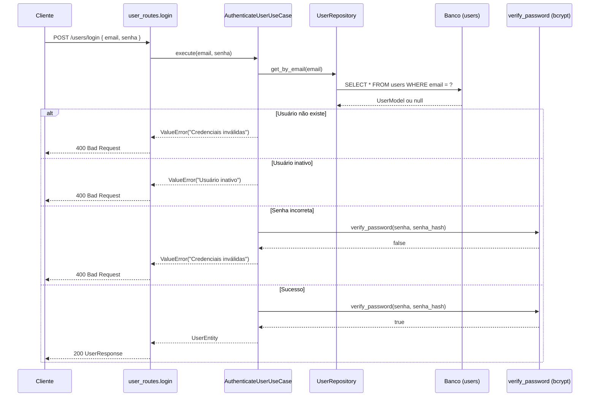

# Login de usuário — GG Imports

Este documento explica como funciona o login no backend da GG Imports: qual endpoint é usado, quais dados entram e saem, e o que acontece em cada camada da aplicação.

---

## Resumo

O login é feito por um único endpoint:

```
POST /users/login
```

O cliente envia **email** e **senha**. O backend busca o usuário no banco, verifica se está ativo, compara a senha com o hash armazenado e, se tudo estiver correto, retorna os dados públicos do usuário.

**Importante:** hoje o login **não gera token JWT** nem mantém sessão. A autenticação valida as credenciais e devolve o perfil do usuário. Há um TODO no código para implementar JWT no futuro.

---

## Endpoint

| Item | Valor |
|------|-------|
| Método | `POST` |
| Rota | `/users/login` |
| Tag Swagger | `Users` |
| Content-Type | `application/json` |
| Resposta de sucesso | `200 OK` |
| Schema de resposta | `UserResponse` |

Implementação em `src/routes/user_routes.py`:

```python
@router.post("/login", response_model=UserResponse)
def login(payload: UserLogin, db: Session = Depends(get_db)):
    def _execute():
        repository = UserRepository(db)
        use_case = AuthenticateUserUseCase(repository)
        return to_user_response(use_case.execute(payload.email, payload.senha))

    return run_use_case(_execute)
```

---

## Corpo da requisição

Schema: `UserLogin` (`src/schemas/user_schema.py`)

| Campo | Tipo | Obrigatório | Descrição |
|-------|------|-------------|-----------|
| `email` | `string` | Sim | Email cadastrado |
| `senha` | `string` | Sim | Senha em texto puro (enviada apenas na requisição) |

Exemplo:

```json
{
  "email": "joao@email.com",
  "senha": "minhasenha123"
}
```

Não há validação extra de formato de email no schema de login (apenas `str`). A validação de formato existe na entidade de domínio, mas só é aplicada na criação do usuário.

---

## Resposta de sucesso

Schema: `UserResponse` (`src/schemas/user_schema.py`)

| Campo | Tipo | Descrição |
|-------|------|-----------|
| `id` | `int` | ID do usuário |
| `nome` | `string` | Nome completo |
| `email` | `string` | Email |
| `telefone` | `string \| null` | Telefone (opcional) |
| `data_cadastro` | `datetime` | Data de criação da conta |
| `role` | `string` | `CLIENTE` ou `ADMIN` |
| `ativo` | `bool` | Se a conta está ativa |

Exemplo:

```json
{
  "id": 1,
  "nome": "João Silva",
  "email": "joao@email.com",
  "telefone": "11999999999",
  "data_cadastro": "2026-06-14T10:30:00",
  "role": "CLIENTE",
  "ativo": true
}
```

A senha e o hash **nunca** são retornados. O mapper `to_user_response()` em `src/routes/mappers.py` monta apenas os campos públicos.

---

## Fluxo passo a passo



### 1. Rota (`user_routes.py`)

- Recebe o JSON e valida com Pydantic (`UserLogin`).
- Abre sessão do banco via `Depends(get_db)`.
- Instancia `UserRepository` e `AuthenticateUserUseCase`.
- Executa dentro de `run_use_case()`, que converte erros de negócio em HTTP.

### 2. Use case (`AuthenticateUserUseCase`)

Arquivo: `src/use_cases/user/authenticate_user.py`

```python
def execute(self, email: str, senha: str) -> UserEntity:
    user = self.user_repository.get_by_email(email)
    if not user:
        raise ValueError("Credenciais inválidas")

    if not user.ativo:
        raise ValueError("Usuário inativo")

    if not verify_password(senha, user.senha_hash):
        raise ValueError("Credenciais inválidas")

    return user
```

Ordem das verificações:

1. Usuário existe?
2. Conta está ativa?
3. Senha confere com o hash?

Por segurança, **email inexistente** e **senha errada** retornam a mesma mensagem: `"Credenciais inválidas"`.

### 3. Repositório (`UserRepository`)

- `get_by_email(email)` consulta a tabela `users`.
- Converte o `UserModel` (SQLAlchemy) em `UserEntity` (domínio).
- O campo `senha_hash` fica na entidade apenas para uso interno na verificação.

### 4. Verificação de senha (`src/utils/password.py`)

```python
def verify_password(password: str, password_hash: str) -> bool:
    return bcrypt.checkpw(
        password.encode("utf-8"),
        password_hash.encode("utf-8"),
    )
```

Usa **bcrypt** para comparar a senha informada com o hash salvo no cadastro.

---

## Erros possíveis

O helper `run_use_case()` em `src/routes/utils.py` transforma `ValueError` em `HTTPException`:

| Situação | Mensagem | HTTP |
|----------|----------|------|
| Email não cadastrado | `Credenciais inválidas` | 400 |
| Senha incorreta | `Credenciais inválidas` | 400 |
| Conta desativada | `Usuário inativo` | 400 |
| JSON inválido / campos faltando | Erro de validação do FastAPI | 422 |

Exemplo de erro:

```json
{
  "detail": "Credenciais inválidas"
}
```

---

## Como a senha é armazenada (cadastro)

O login só funciona se o usuário foi criado antes com senha hasheada. Isso acontece em:

| Fluxo | Endpoint | Use case |
|-------|----------|----------|
| Usuário genérico | `POST /users/` | `CreateUserUseCase` |
| Cliente | `POST /clients/` | `CreateClientUseCase` |
| Admin | `POST /admins/` | `CreateAdminUseCase` |

Em todos os casos, a senha passa por `hash_password()` antes de ir para o banco:

```python
def hash_password(password: str) -> str:
    return bcrypt.hashpw(password.encode("utf-8"), bcrypt.gensalt()).decode("utf-8")
```

Na tabela `users`, o valor fica na coluna `senha_hash` (nunca em texto puro).

---

## Quem pode fazer login?

Qualquer registro na tabela `users` com email e senha válidos:

- **CLIENTE** — criado via `POST /clients/` ou `POST /users/` com `role: "CLIENTE"`
- **ADMIN** — criado via `POST /admins/` ou `POST /users/` com `role: "ADMIN"`

O login é **único** para todos os tipos. A diferença está no campo `role` da resposta. Rotas específicas de cliente (`/clients/...`) ou admin (`/admins/...`) são consultadas separadamente, se necessário.

---

## O que ainda não está implementado

### JWT / token de acesso

No código há um TODO explícito:

```python
# TODO: retornar JWT após implementar autenticação
```

As variáveis já existem em `src/config/config.py`, mas **não são usadas** no login:

| Variável | Padrão | Uso atual |
|----------|--------|-----------|
| `SECRET_KEY` | — | Não usada no login |
| `ALGORITHM` | `HS256` | Não usada no login |
| `ACCESS_TOKEN_EXPIRE_MINUTES` | `30` | Não usada no login |

O pacote `python-jose` está no `requirements.txt`, preparado para implementação futura.

### Middleware de autenticação

Nenhuma rota exige token hoje. Endpoints sensíveis (criar produto, listar pedidos, etc.) têm TODOs para validar permissão de admin quando o middleware existir.

### Sessão no frontend

O frontend ainda não consome `POST /users/login`. Após integrar, será preciso decidir como guardar o estado logado (localStorage, cookie, contexto React, etc.) — especialmente quando o JWT for implementado.

---

## Exemplo com cURL

```bash
curl -X POST http://localhost:8000/users/login \
  -H "Content-Type: application/json" \
  -d "{\"email\": \"joao@email.com\", \"senha\": \"minhasenha123\"}"
```

## Exemplo com fetch (JavaScript)

```javascript
const response = await fetch("http://localhost:8000/users/login", {
  method: "POST",
  headers: { "Content-Type": "application/json" },
  body: JSON.stringify({
    email: "joao@email.com",
    senha: "minhasenha123",
  }),
});

if (!response.ok) {
  const error = await response.json();
  throw new Error(error.detail);
}

const user = await response.json();
console.log(user.role); // "CLIENTE" ou "ADMIN"
```

---

## Arquivos envolvidos

| Arquivo | Papel |
|---------|-------|
| `src/routes/user_routes.py` | Endpoint `POST /users/login` |
| `src/schemas/user_schema.py` | `UserLogin` e `UserResponse` |
| `src/use_cases/user/authenticate_user.py` | Regras de autenticação |
| `src/repositories/user_repository.py` | Busca usuário por email |
| `src/utils/password.py` | Hash e verificação bcrypt |
| `src/routes/mappers.py` | Converte entidade → resposta HTTP |
| `src/routes/utils.py` | Tratamento de erros (`run_use_case`) |
| `src/models/user_model.py` | Tabela `users` no banco |
| `src/entities/user.py` | Entidade de domínio do usuário |
| `src/config/config.py` | Configurações JWT (futuro) |

---

## Visão geral do ciclo de autenticação

```
Cadastro                    Login (atual)                 Futuro (planejado)
────────                    ─────────────                 ──────────────────
POST /users/                POST /users/login             POST /users/login
POST /clients/        →     email + senha           →     + retorno de JWT
POST /admins/               ↓                             ↓
                            valida credenciais          rotas protegidas
                            ↓                             com Bearer token
                            retorna UserResponse
                            (sem token)
```

Hoje o login **confirma a identidade** e devolve dados do usuário. A **autorização persistente** (manter o usuário logado entre requisições) ainda precisa ser implementada.
